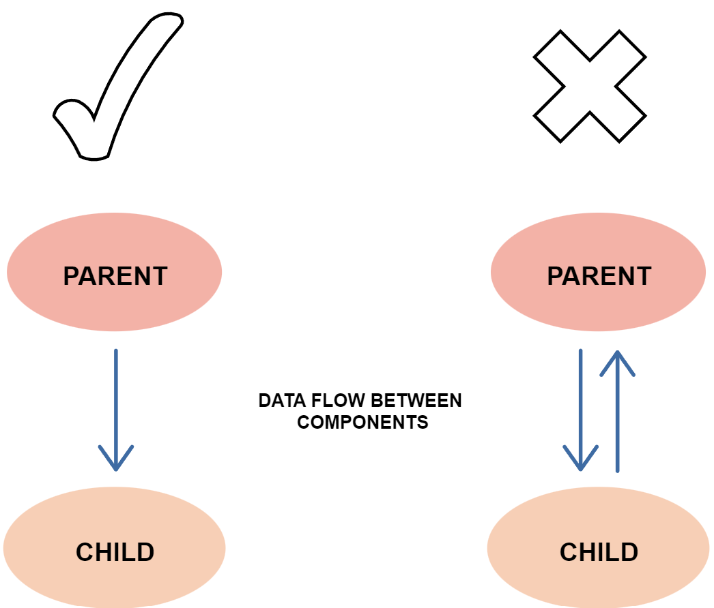

# React Study Material and Projects :
   - This document is formated and Created by : [Soumitra Saha.](https://twitter.com/SoumitraSaha100 "Soumitra Saha")


  - Soumitra Saha [Twitter](https://twitter.com/SoumitraSaha100 "Soumitra Saha")

  - Soumitra Saha [LinkedIn](https://www.linkedin.com/in/soumitra-saha-a9810622a "SOUMITRA SAHA")


  - Soumitra Saha [GitHub](https://github.com/SOUMITRO-SAHA)

## Overview:

### What is React?

React (aka, React.js) is a free  and [Open-source](https://github.com/facebook/react/) front-end JavaScript libery for building user interfaces based on UI components. It is maintained by Meta (formerly known as Facebook) and a community of individual developers and companies. React can be used as a base in the developement of [single-page](https://developer.mozilla.org/en-US/docs/Glossary/SPA), mobile, or server-rendered applications with frameworks like Next.js.
[more...](https://reactjs.org/tutorial/tutorial.html#what-is-react)

### Birth of React.js :

Peact was created by Jordan Walke, a software enginner at Facebook, who released an early prototype of React called "***FaxJS***". He was influenced by XHP, and HTML component library for PHP. It was first deployed on Facebook's News Feed in 2011 and later on Instagram in 2012. It was [Open-source](https://github.com/facebook/react/) at JSConf Us in May 2013.
#### Advantages of React :

- **Practicality** : React is a simple framework to use and learn. A developer with JavaScript experience can quickly grasp the concept and develop application.
- **Speed** : React's speed has increased as a result of the Virtual document object model. ReactJS is extremely fast. ReactJS becomes signigicantly better than other frameworks as a result of thiis functionality.
- **React component reusability** : React is a component framework. It comprises a hierarchy of components, each with its logic and controls. React's components are responsible for producing short, reusable HTML code that can be reused. This reusable code simplifies the design and maintenance of React applications.
- **Handiness** : React is also popular due to its valuable collection of developer tools. Its Chrome and Firefox dev extensions allow it to investigate the hierarchies of react components in the virtual DOM.
- **SEO-friendliness** : React addresses the issue of search engines having difficulty reading massive JavaScript apps, making it easier for developers to navigate across numerous search engines.

####  Big Tech Companies Using React :

1. Facebook
2. Netflix
3. Uber
4. Airbnb
5. Dropbox
6. Mozilla (MDN developer site)

### Declarative vs Imperative Programming paradigm:

Functional Programming is a declarative programming paradigm, in contrast to imperative programming paradigms.

Declarative programming is a paradigm describing WHAT the program does, without explicitly specifying its control flow.

Imperative programming is a paradigm describing HOW the program should do something by explicitly specifying each instruction (or statement) step by step, which mutates the program's state.

### What problem React solves :

In Imperative Programming, we directly change individual parts of our app in response to various user events. The problem with this imperative approach is that it becomes difficult to see the relationships between events and all the edge cases. 
Well, instead of this imperative approach React comes up with a novel concept a more declarative approach and this is what React says to us.

Hey, DOM manipulation is one of the biggest performance bottlenecks. It takes a long time for DOM changes to happen. The browser has to do two really intensive operations. One is to repaint, that is change an element and added onto a page and then refloat which is to recalculate the layout of the page and move things around if need to be. **So, changing the DOM was a really expensive operation.**

So, React says to us, Hey let me take care of that.  I’ll find the best way for me to change the DOM and just declare to me what your app looks like. I’ll do everything for you. I’ll find the best way to use the DOM. You are never going to touch the DOM. Just tell me what the page should look like. That is the best example of the Declarative Programming Paradigm.

### Component Architecture :

React is designed around the concept of reusable components. React had this idea of small components that you put together to form bigger components.
- React app starts with a single root component.
- Root component is build using one or more component.
- Component can be nested with other components to any level.
- Composition is one of the core concept of React libery. So, each component is build by composing smaller components instead of inheriting one component from another component.
- Most of the components are user interface components.
- React app can include third party component for specific purpose such as routing, animation, state management, etc.

### One Way Data Flow :

React doesn't allow omnidirectional data flow, It allows Unidirectional data flow describes as one-way data flow where the data can move in only one pathway when being transferred between different parts of the program.
React, a Javascript libery, uses unidirectional data flow. The data from the parent is known as **props**. You can only transfer data from parent to child and not vice versa.



[Source of the Content](https://www.educative.io/answers/what-is-unidirectional-data-flow-in-react)


# React Basic :

### Create React App:

```bash
npx create-react-app app-name
cd app-name
npm start
```

### React-Script :

#### What is script ?

In programming, a script is a list of instructions that dectates what to do to another program; React no exception. Create React App ships with four main scripts.

Whenever we create a React app using the above command line every configuration required for the React app comes through the react-scripts package. We can check the `package.json` file for the newly created project.

In React apps, scripts are located in the `package.json` file’s `script` section, as shown below:
```json
"scripts": {
    "start": "react-scripts start",
    "build": "react-scripts build",
    "test": "react-scripts test",
    "eject": "react-scripts eject"
  }
```
- `start` `build` `test` `eject` 


Detailed Article on React-script : 
    [LogRocket by Ibrahima Ndaw](https://blog.logrocket.com/everything-you-need-know-about-react-scripts/)

#### Hooks VS Classes

#### React 18 Strich Mode :

#### Class Components :

#### Component State :

#### Single Page Application (SPAs)

#### Lifecycle Method :

***Diagram :***


#### Functional Component :

