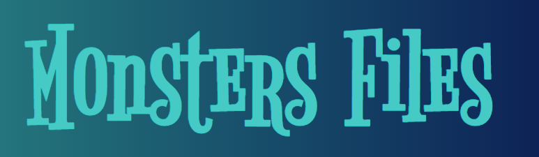

# Monsters-Files Project:

***Description :*** 
It is my first React project,  Its very simple project, just to clear the fundamentals.

----

### Topics Covered In this Project :

- React Key Concepts
- NPM vs YARN
- Creating react app [NPX]
- React-Script
  - `start` 
  - `build` 
  - `test` 
  - `eject`

- Eject in React-Script (in Details)
- Hooks vs Classes
- React 18 Strict Mode
- Class Components
- Component State
  - setState
  - States and Shallow Merge
  - setState and Secondary Callback
- Mapping Arrays to Elements
- JavaScript Concepts Like :
  - `map()` , `filter()` , `includes()` , ` Promises` , `async & await`, `find()` , `reduce()` , `Memoizaton`

- Code Optimization
- Components
  - Props
  - Rendering and Re-rendering

- Class Based Components
- React CSS (How to manage CSS in React)
